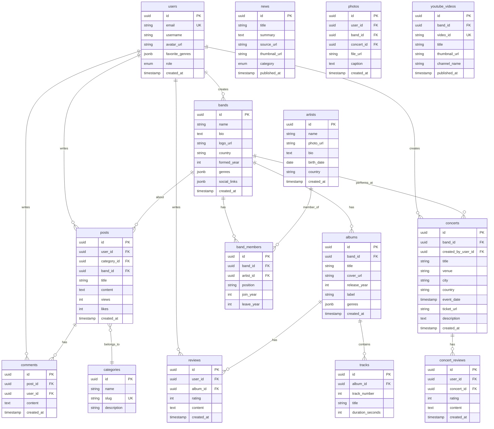

# LLD: Rock Community 기술 설계

## 1. 시스템 아키텍처

### 1.1 전체 아키텍처 다이어그램

```
┌─────────────────────────────────────────────────────────────────┐
│                         Client Layer                             │
│  ┌──────────────┐  ┌──────────────┐  ┌──────────────────────┐  │
│  │   Browser    │  │    Mobile    │  │   Search Engines     │  │
│  │  (Desktop)   │  │   (PWA)      │  │   (SEO Crawlers)     │  │
│  └──────────────┘  └──────────────┘  └──────────────────────┘  │
└─────────────────────────────────────────────────────────────────┘
                              ↓ HTTPS
┌─────────────────────────────────────────────────────────────────┐
│                      Cloudflare CDN                              │
│  ┌──────────────────────────────────────────────────────────┐   │
│  │  SSL/TLS │ DDoS Protection │ Caching │ DNS Management   │   │
│  └──────────────────────────────────────────────────────────┘   │
└─────────────────────────────────────────────────────────────────┘
                              ↓
┌─────────────────────────────────────────────────────────────────┐
│                    Next.js Application                           │
│  ┌──────────────────────────────────────────────────────────┐   │
│  │  App Router (RSC)  │  API Routes  │  Middleware         │   │
│  │  - Server Components                                     │   │
│  │  - Client Components (Emotion CSS-in-JS)                 │   │
│  │  - Radix UI Primitives                                   │   │
│  └──────────────────────────────────────────────────────────┘   │
└─────────────────────────────────────────────────────────────────┘
                              ↓
┌─────────────────────────────────────────────────────────────────┐
│                      Supabase Backend                            │
│  ┌───────────────┐  ┌───────────────┐  ┌──────────────────┐    │
│  │   Auth        │  │   Postgres    │  │   Storage        │    │
│  │   (JWT)       │  │   (Drizzle)   │  │   (Images/Files) │    │
│  └───────────────┘  └───────────────┘  └──────────────────┘    │
│  ┌───────────────┐  ┌───────────────┐  ┌──────────────────┐    │
│  │   Realtime    │  │ Edge Functions│  │   RLS Policies   │    │
│  │   (WebSocket) │  │   (Deno)      │  │                  │    │
│  └───────────────┘  └───────────────┘  └──────────────────┘    │
└─────────────────────────────────────────────────────────────────┘
                              ↓
┌─────────────────────────────────────────────────────────────────┐
│                    External Services                             │
│  ┌───────────────┐  ┌───────────────┐  ┌──────────────────┐    │
│  │ Upstash Redis │  │ YouTube API   │  │ Rock News APIs   │    │
│  │ (KV Cache)    │  │               │  │ (RSS Feeds)      │    │
│  └───────────────┘  └───────────────┘  └──────────────────┘    │
│  ┌───────────────┐  ┌───────────────┐  ┌──────────────────┐    │
│  │ Resend/       │  │ MusicBrainz   │  │ Grafana Cloud    │    │
│  │ SendGrid      │  │ API (Band DB) │  │ (Monitoring)     │    │
│  └───────────────┘  └───────────────┘  └──────────────────┘    │
└─────────────────────────────────────────────────────────────────┘
                              ↓
┌─────────────────────────────────────────────────────────────────┐
│                    Monitoring Stack                              │
│  ┌──────────────────────────────────────────────────────────┐   │
│  │  Loki (Logs) │ Grafana (Dashboard) │ Promtail (Shipper) │   │
│  └──────────────────────────────────────────────────────────┘   │
└─────────────────────────────────────────────────────────────────┘
```

---

## 2. 기술 스택

### 2.1 프론트엔드

#### 2.1.1 프레임워크
- **Next.js 15** (App Router)
  - React Server Components (RSC) 적극 활용
  - Server Actions for Mutations
  - Middleware for Auth Check
  - Image Optimization (next/image)
  - Font Optimization (next/font)

#### 2.1.2 UI/스타일링
- **Emotion 11** (CSS-in-JS)
- **Radix UI** (Primitive 컴포넌트)
- **Utility Styles** (rcss-like)

#### 2.1.3 상태 관리
- **React Server State**: RSC로 기본 처리
- **Client State**: React Context + useState/useReducer
- **Server State Caching**: @tanstack/react-query, Upstash Redis

#### 2.1.4 기타 라이브러리
- **react-markdown**: 마크다운 렌더링
- **react-big-calendar**: 공연 일정 캘린더
- **recharts**: 통계 차트
- **framer-motion**: 애니메이션
- **react-dropzone**: 파일 업로드
- **yet-another-react-lightbox**: 이미지 라이트박스

### 2.2 백엔드

#### 2.2.1 BaaS (Backend as a Service)
- **Supabase**
  - Auth, Postgres, Storage, Realtime, Edge Functions, RLS

#### 2.2.2 ORM/데이터베이스
- **Drizzle ORM**

#### 2.2.3 캐싱/세션
- **Upstash Redis**

#### 2.2.4 크롤링/자동화
- **Supabase Edge Functions (Deno)**

### 2.3 외부 API/서비스

#### 2.3.1 Rock 뉴스 API
- **Rolling Stone** RSS
- **NME** RSS
- **Metal Hammer** RSS
- **Loudwire** RSS

#### 2.3.2 음악 데이터베이스 API
- **MusicBrainz API** (밴드/앨범 정보)
- **Last.fm API** (아티스트 정보, 추천)

#### 2.3.3 YouTube API
- **YouTube Data API v3** (Rock 영상)

#### 2.3.4 이메일 전송
- **Resend** (React Email 템플릿 지원)

---

## 3. 데이터베이스 설계

### 3.1 스키마 다이어그램



### 3.2 테이블 정의 (Drizzle Schema)

#### 3.2.1 users (사용자)

```typescript
// schema/users.ts
import { pgTable, uuid, varchar, text, timestamp, jsonb, pgEnum } from 'drizzle-orm/pg-core';

export const roleEnum = pgEnum('user_role', ['admin', 'user']);

export const users = pgTable('users', {
  id: uuid('id').primaryKey().defaultRandom(),
  email: varchar('email', { length: 255 }).notNull().unique(),
  username: varchar('username', { length: 50 }).notNull(),
  avatarUrl: text('avatar_url'),
  bio: text('bio'),
  favoriteGenres: jsonb('favorite_genres'), // ["Metal", "Hard Rock"]
  role: roleEnum('role').notNull().default('user'),
  createdAt: timestamp('created_at').notNull().defaultNow(),
  updatedAt: timestamp('updated_at').notNull().defaultNow(),
});
```

#### 3.2.2 bands (밴드)

```typescript
// schema/bands.ts
export const bands = pgTable('bands', {
  id: uuid('id').primaryKey().defaultRandom(),
  name: varchar('name', { length: 255 }).notNull(),
  bio: text('bio'),
  logoUrl: text('logo_url'),
  country: varchar('country', { length: 100 }),
  formedYear: integer('formed_year'),
  genres: jsonb('genres'), // ["Hard Rock", "Heavy Metal"]
  socialLinks: jsonb('social_links'), // {facebook: "...", instagram: "..."}
  createdAt: timestamp('created_at').notNull().defaultNow(),
  updatedAt: timestamp('updated_at').notNull().defaultNow(),
});
```

#### 3.2.3 albums (앨범)

```typescript
// schema/albums.ts
export const albums = pgTable('albums', {
  id: uuid('id').primaryKey().defaultRandom(),
  bandId: uuid('band_id').notNull().references(() => bands.id),
  title: varchar('title', { length: 255 }).notNull(),
  coverUrl: text('cover_url'),
  releaseYear: integer('release_year'),
  label: varchar('label', { length: 100 }),
  genres: jsonb('genres'),
  createdAt: timestamp('created_at').notNull().defaultNow(),
});
```

#### 3.2.4 tracks (트랙)

```typescript
// schema/tracks.ts
export const tracks = pgTable('tracks', {
  id: uuid('id').primaryKey().defaultRandom(),
  albumId: uuid('album_id').notNull().references(() => albums.id, { onDelete: 'cascade' }),
  trackNumber: integer('track_number').notNull(),
  title: varchar('title', { length: 255 }).notNull(),
  durationSeconds: integer('duration_seconds'),
});
```

#### 3.2.5 artists (아티스트)

```typescript
// schema/artists.ts
export const artists = pgTable('artists', {
  id: uuid('id').primaryKey().defaultRandom(),
  name: varchar('name', { length: 255 }).notNull(),
  photoUrl: text('photo_url'),
  bio: text('bio'),
  birthDate: date('birth_date'),
  country: varchar('country', { length: 100 }),
  createdAt: timestamp('created_at').notNull().defaultNow(),
});
```

#### 3.2.6 band_members (밴드 멤버)

```typescript
// schema/band_members.ts
export const bandMembers = pgTable('band_members', {
  id: uuid('id').primaryKey().defaultRandom(),
  bandId: uuid('band_id').notNull().references(() => bands.id),
  artistId: uuid('artist_id').notNull().references(() => artists.id),
  position: varchar('position', { length: 100 }), // "Vocals", "Guitar", "Drums"
  joinYear: integer('join_year'),
  leaveYear: integer('leave_year'),
  createdAt: timestamp('created_at').notNull().defaultNow(),
});
```

#### 3.2.7 concerts (공연)

```typescript
// schema/concerts.ts
export const concerts = pgTable('concerts', {
  id: uuid('id').primaryKey().defaultRandom(),
  bandId: uuid('band_id').notNull().references(() => bands.id),
  createdByUserId: uuid('created_by_user_id').notNull().references(() => users.id),
  title: varchar('title', { length: 255 }).notNull(),
  venue: varchar('venue', { length: 255 }).notNull(),
  city: varchar('city', { length: 100 }),
  country: varchar('country', { length: 100 }),
  eventDate: timestamp('event_date').notNull(),
  ticketUrl: text('ticket_url'),
  description: text('description'),
  createdAt: timestamp('created_at').notNull().defaultNow(),
});
```

#### 3.2.8 reviews (앨범 리뷰)

```typescript
// schema/reviews.ts
export const reviews = pgTable('reviews', {
  id: uuid('id').primaryKey().defaultRandom(),
  userId: uuid('user_id').notNull().references(() => users.id),
  albumId: uuid('album_id').notNull().references(() => albums.id),
  rating: integer('rating').notNull(), // 1-10
  content: text('content').notNull(),
  createdAt: timestamp('created_at').notNull().defaultNow(),
});
```

#### 3.2.9 concert_reviews (공연 리뷰)

```typescript
// schema/concert_reviews.ts
export const concertReviews = pgTable('concert_reviews', {
  id: uuid('id').primaryKey().defaultRandom(),
  userId: uuid('user_id').notNull().references(() => users.id),
  concertId: uuid('concert_id').notNull().references(() => concerts.id),
  rating: integer('rating').notNull(), // 1-10
  content: text('content').notNull(),
  createdAt: timestamp('created_at').notNull().defaultNow(),
});
```

#### 3.2.10 posts (게시글)

```typescript
// schema/posts.ts
export const posts = pgTable('posts', {
  id: uuid('id').primaryKey().defaultRandom(),
  userId: uuid('user_id').notNull().references(() => users.id),
  categoryId: uuid('category_id').notNull().references(() => categories.id),
  bandId: uuid('band_id').references(() => bands.id), // 밴드 관련 글일 경우
  title: varchar('title', { length: 255 }).notNull(),
  content: text('content').notNull(),
  views: integer('views').notNull().default(0),
  likes: integer('likes').notNull().default(0),
  createdAt: timestamp('created_at').notNull().defaultNow(),
  updatedAt: timestamp('updated_at').notNull().defaultNow(),
});
```

#### 3.2.11 categories (카테고리)

```typescript
// schema/categories.ts
export const categories = pgTable('categories', {
  id: uuid('id').primaryKey().defaultRandom(),
  name: varchar('name', { length: 100 }).notNull(),
  slug: varchar('slug', { length: 100 }).notNull().unique(),
  description: text('description'),
  createdAt: timestamp('created_at').notNull().defaultNow(),
});

// 기본 카테고리 Seed Data
// - general_discussion (General Discussion)
// - album_reviews (Album Reviews)
// - concert_reviews (Concert Reviews)
// - hot_topics (Hot Topics)
// - rock_art (Rock Art Showcase)
```

#### 3.2.12 comments (댓글)

```typescript
// schema/comments.ts
export const comments = pgTable('comments', {
  id: uuid('id').primaryKey().defaultRandom(),
  postId: uuid('post_id').notNull().references(() => posts.id, { onDelete: 'cascade' }),
  userId: uuid('user_id').notNull().references(() => users.id),
  content: text('content').notNull(),
  createdAt: timestamp('created_at').notNull().defaultNow(),
});
```

#### 3.2.13 news (뉴스)

```typescript
// schema/news.ts
export const newsCategoryEnum = pgEnum('news_category', [
  'classic_rock',
  'metal',
  'punk',
  'alternative',
  'general',
]);

export const news = pgTable('news', {
  id: uuid('id').primaryKey().defaultRandom(),
  title: varchar('title', { length: 500 }).notNull(),
  summary: text('summary'),
  sourceUrl: text('source_url').notNull().unique(),
  thumbnailUrl: text('thumbnail_url'),
  category: newsCategoryEnum('category').notNull(),
  publishedAt: timestamp('published_at').notNull(),
  crawledAt: timestamp('crawled_at').notNull().defaultNow(),
});
```

#### 3.2.14 photos (사진 갤러리)

```typescript
// schema/photos.ts
export const photos = pgTable('photos', {
  id: uuid('id').primaryKey().defaultRandom(),
  userId: uuid('user_id').notNull().references(() => users.id),
  bandId: uuid('band_id').references(() => bands.id),
  concertId: uuid('concert_id').references(() => concerts.id),
  fileUrl: text('file_url').notNull(),
  caption: text('caption'),
  createdAt: timestamp('created_at').notNull().defaultNow(),
});
```

#### 3.2.15 youtube_videos (유튜브 영상)

```typescript
// schema/youtube_videos.ts
export const youtubeVideos = pgTable('youtube_videos', {
  id: uuid('id').primaryKey().defaultRandom(),
  bandId: uuid('band_id').references(() => bands.id),
  videoId: varchar('video_id', { length: 20 }).notNull().unique(),
  title: varchar('title', { length: 255 }).notNull(),
  thumbnailUrl: text('thumbnail_url').notNull(),
  channelName: varchar('channel_name', { length: 100 }),
  publishedAt: timestamp('published_at').notNull(),
  createdAt: timestamp('created_at').notNull().defaultNow(),
});
```

### 3.3 인덱스 전략

```sql
-- 성능 최적화를 위한 인덱스
CREATE INDEX idx_bands_name ON bands(name);
CREATE INDEX idx_bands_country ON bands(country);
CREATE INDEX idx_albums_band_id ON albums(band_id);
CREATE INDEX idx_albums_release_year ON albums(release_year DESC);
CREATE INDEX idx_band_members_band_id ON band_members(band_id);
CREATE INDEX idx_band_members_artist_id ON band_members(artist_id);
CREATE INDEX idx_concerts_band_id ON concerts(band_id);
CREATE INDEX idx_concerts_event_date ON concerts(event_date DESC);
CREATE INDEX idx_concerts_city ON concerts(city);
CREATE INDEX idx_reviews_album_id ON reviews(album_id);
CREATE INDEX idx_reviews_user_id ON reviews(user_id);
CREATE INDEX idx_concert_reviews_concert_id ON concert_reviews(concert_id);
CREATE INDEX idx_posts_user_id ON posts(user_id);
CREATE INDEX idx_posts_category_id ON posts(category_id);
CREATE INDEX idx_posts_band_id ON posts(band_id);
CREATE INDEX idx_posts_created_at ON posts(created_at DESC);
CREATE INDEX idx_comments_post_id ON comments(post_id);
CREATE INDEX idx_news_category ON news(category);
CREATE INDEX idx_news_published_at ON news(published_at DESC);
CREATE INDEX idx_photos_band_id ON photos(band_id);
CREATE INDEX idx_photos_concert_id ON photos(concert_id);
CREATE INDEX idx_youtube_videos_band_id ON youtube_videos(band_id);
```

---

## 4. API 설계

### 4.1 밴드 API

#### 4.1.1 밴드 목록 조회
```typescript
// GET /api/bands?genre=metal&country=USA&page=1&limit=20
export async function GET(request: Request) {
  const { searchParams } = new URL(request.url);
  const genre = searchParams.get('genre');
  const country = searchParams.get('country');
  const page = parseInt(searchParams.get('page') || '1');
  const limit = parseInt(searchParams.get('limit') || '20');

  const bands = await db
    .select()
    .from(bandsTable)
    .where(
      and(
        genre ? sql`${bandsTable.genres}::jsonb @> ${JSON.stringify([genre])}` : undefined,
        country ? eq(bandsTable.country, country) : undefined
      )
    )
    .orderBy(desc(bandsTable.createdAt))
    .limit(limit)
    .offset((page - 1) * limit);

  return Response.json({ bands, page, limit });
}
```

#### 4.1.2 밴드 상세 조회
```typescript
// GET /api/bands/[id]
export async function GET(request: Request, { params }: { params: { id: string } }) {
  const band = await db
    .select()
    .from(bandsTable)
    .where(eq(bandsTable.id, params.id))
    .leftJoin(albumsTable, eq(bandsTable.id, albumsTable.bandId))
    .leftJoin(bandMembersTable, eq(bandsTable.id, bandMembersTable.bandId))
    .leftJoin(artistsTable, eq(bandMembersTable.artistId, artistsTable.id));

  return Response.json({ band });
}
```

#### 4.1.3 밴드 등록
```typescript
// POST /api/bands
export async function POST(request: Request) {
  const session = await getSession();
  if (!session) return Response.json({ error: 'Unauthorized' }, { status: 401 });

  const { name, bio, country, formedYear, genres, socialLinks } = await request.json();

  const [band] = await db
    .insert(bandsTable)
    .values({ name, bio, country, formedYear, genres, socialLinks })
    .returning();

  return Response.json({ band }, { status: 201 });
}
```

### 4.2 앨범 API

#### 4.2.1 앨범 리뷰 작성
```typescript
// POST /api/albums/[albumId]/reviews
export async function POST(request: Request, { params }: { params: { albumId: string } }) {
  const session = await getSession();
  if (!session) return Response.json({ error: 'Unauthorized' }, { status: 401 });

  const { rating, content } = await request.json();

  const [review] = await db
    .insert(reviewsTable)
    .values({
      userId: session.user.id,
      albumId: params.albumId,
      rating,
      content,
    })
    .returning();

  return Response.json({ review }, { status: 201 });
}
```

### 4.3 공연 API

#### 4.3.1 공연 일정 조회
```typescript
// GET /api/concerts?start=2025-10-01&end=2025-10-31&city=Seoul
export async function GET(request: Request) {
  const { searchParams } = new URL(request.url);
  const start = searchParams.get('start');
  const end = searchParams.get('end');
  const city = searchParams.get('city');

  const concerts = await db
    .select()
    .from(concertsTable)
    .where(
      and(
        start ? gte(concertsTable.eventDate, new Date(start)) : undefined,
        end ? lte(concertsTable.eventDate, new Date(end)) : undefined,
        city ? eq(concertsTable.city, city) : undefined
      )
    )
    .orderBy(asc(concertsTable.eventDate));

  return Response.json({ concerts });
}
```

#### 4.3.2 공연 등록
```typescript
// POST /api/concerts
export async function POST(request: Request) {
  const session = await getSession();
  if (!session) return Response.json({ error: 'Unauthorized' }, { status: 401 });

  const { bandId, title, venue, city, country, eventDate, ticketUrl, description } =
    await request.json();

  const [concert] = await db
    .insert(concertsTable)
    .values({
      bandId,
      createdByUserId: session.user.id,
      title,
      venue,
      city,
      country,
      eventDate: new Date(eventDate),
      ticketUrl,
      description,
    })
    .returning();

  return Response.json({ concert }, { status: 201 });
}
```

### 4.4 Edge Functions API (Supabase)

#### 4.4.1 Rock 뉴스 크롤러
```typescript
// supabase/functions/crawl-rock-news/index.ts
import { serve } from 'https://deno.land/std@0.168.0/http/server.ts';
import { createClient } from 'https://esm.sh/@supabase/supabase-js@2';

serve(async (req) => {
  const supabase = createClient(
    Deno.env.get('SUPABASE_URL')!,
    Deno.env.get('SUPABASE_SERVICE_ROLE_KEY')!
  );

  // Rock 뉴스 크롤링
  const rollingStoneNews = await fetchRSS('https://www.rollingstone.com/music/music-news/feed/');
  const nmeNews = await fetchRSS('https://www.nme.com/news/music/feed');
  const metalHammerNews = await fetchRSS('https://www.loudersound.com/metal-hammer/feed');
  const loudwireNews = await fetchRSS('https://loudwire.com/feed/');

  const allNews = [...rollingStoneNews, ...nmeNews, ...metalHammerNews, ...loudwireNews];

  // DB에 저장
  const { data, error } = await supabase
    .from('news')
    .upsert(allNews, { onConflict: 'source_url' });

  return new Response(JSON.stringify({ success: true, count: data?.length }), {
    headers: { 'Content-Type': 'application/json' },
  });
});

async function fetchRSS(url: string) {
  const response = await fetch(url);
  const xml = await response.text();
  // RSS 파싱 로직 (DOMParser 사용)
  return parsedNews;
}
```

#### 4.4.2 MusicBrainz 밴드 정보 가져오기
```typescript
// supabase/functions/fetch-band-info/index.ts
serve(async (req) => {
  const { bandName } = await req.json();

  // MusicBrainz API 호출
  const response = await fetch(
    `https://musicbrainz.org/ws/2/artist/?query=artist:${encodeURIComponent(bandName)}&fmt=json`
  );
  const data = await response.json();

  return new Response(JSON.stringify({ success: true, data }));
});
```

---

## 5. 파일 구조

```
rock-community/
├── app/
│   ├── (auth)/
│   │   ├── login/page.tsx
│   │   └── signup/page.tsx
│   ├── (dashboard)/
│   │   └── admin/
│   │       ├── page.tsx
│   │       ├── bands/page.tsx
│   │       ├── albums/page.tsx
│   │       └── concerts/page.tsx
│   ├── about/page.tsx
│   ├── bands/
│   │   ├── page.tsx                    # 밴드 목록
│   │   └── [id]/
│   │       └── page.tsx                # 밴드 상세
│   ├── albums/
│   │   ├── page.tsx                    # 앨범 목록
│   │   └── [id]/page.tsx               # 앨범 상세
│   ├── concerts/
│   │   └── page.tsx                    # 공연 캘린더
│   ├── community/
│   │   ├── [category]/
│   │   │   ├── page.tsx                # 게시판 목록
│   │   │   └── [id]/page.tsx           # 게시글 상세
│   ├── news/page.tsx                   # Rock 뉴스
│   ├── gallery/page.tsx                # 포토 갤러리
│   ├── rock-art/page.tsx               # AI Rock Art
│   ├── videos/page.tsx                 # YouTube 영상
│   ├── contact/page.tsx                # 문의하기
│   ├── api/
│   │   ├── bands/route.ts
│   │   ├── albums/route.ts
│   │   ├── concerts/route.ts
│   │   ├── reviews/route.ts
│   │   ├── posts/route.ts
│   │   └── news/route.ts
│   ├── layout.tsx
│   ├── page.tsx                        # 홈페이지
│   └── globals.css
├── components/
│   ├── ui/
│   ├── layout/
│   ├── bands/
│   │   ├── BandCard.tsx
│   │   ├── BandProfile.tsx
│   │   └── BandList.tsx
│   ├── albums/
│   │   ├── AlbumCard.tsx
│   │   └── ReviewForm.tsx
│   ├── concerts/
│   │   ├── ConcertCalendar.tsx
│   │   └── ConcertCard.tsx
│   ├── community/
│   │   ├── PostList.tsx
│   │   ├── PostCard.tsx
│   │   └── CommentSection.tsx
│   └── admin/
│       └── Dashboard.tsx
├── lib/
│   ├── supabase/
│   ├── db/
│   │   ├── drizzle.ts
│   │   ├── schema/
│   │   │   ├── users.ts
│   │   │   ├── bands.ts
│   │   │   ├── albums.ts
│   │   │   ├── artists.ts
│   │   │   ├── concerts.ts
│   │   │   ├── reviews.ts
│   │   │   ├── posts.ts
│   │   │   ├── news.ts
│   │   │   ├── photos.ts
│   │   │   └── index.ts
│   │   └── queries/
│   ├── redis/
│   ├── styles/
│   └── utils/
├── supabase/
│   ├── functions/
│   │   ├── crawl-rock-news/index.ts
│   │   ├── fetch-band-info/index.ts
│   │   ├── crawl-youtube/index.ts
│   │   └── send-email/index.ts
│   ├── migrations/
│   └── seed.sql
├── PRD.md
├── LLD.md
├── PLAN.md
└── package.json
```

---

## 6. 외부 서비스 연동

### 6.1 Rock 뉴스 크롤링

#### 6.1.1 Rock 뉴스 출처
- **Rolling Stone**: https://www.rollingstone.com/music/music-news/feed/
- **NME**: https://www.nme.com/news/music/feed
- **Metal Hammer**: https://www.loudersound.com/metal-hammer/feed
- **Loudwire**: https://loudwire.com/feed/

### 6.2 음악 데이터베이스 API

#### 6.2.1 MusicBrainz API
- 밴드 정보 조회
- 앨범 정보 조회
- 아티스트 정보 조회

```typescript
// lib/musicbrainz.ts
export async function searchBand(bandName: string) {
  const response = await fetch(
    `https://musicbrainz.org/ws/2/artist/?query=artist:${encodeURIComponent(bandName)}&fmt=json`
  );
  return response.json();
}
```

### 6.3 YouTube API 연동

#### 6.3.1 Rock 영상 검색
```typescript
// lib/youtube.ts
export async function searchRockVideos(query: string) {
  const response = await fetch(
    `https://www.googleapis.com/youtube/v3/search?part=snippet&q=${encodeURIComponent(
      query + ' rock music'
    )}&type=video&maxResults=50&key=${YOUTUBE_API_KEY}`
  );
  return response.json();
}
```

---

## 7. 보안 설계

### 7.1 RLS 정책

#### 7.1.1 밴드 테이블 RLS
```sql
-- 모든 사용자는 밴드 정보 조회 가능
CREATE POLICY "Bands are viewable by everyone"
  ON bands FOR SELECT
  USING (true);

-- 로그인 사용자는 밴드 등록 가능
CREATE POLICY "Authenticated users can create bands"
  ON bands FOR INSERT
  WITH CHECK (auth.uid() IS NOT NULL);

-- 관리자만 밴드 정보 수정 가능
CREATE POLICY "Admins can update bands"
  ON bands FOR UPDATE
  USING (EXISTS (
    SELECT 1 FROM users WHERE id = auth.uid() AND role = 'admin'
  ));
```

#### 7.1.2 리뷰 테이블 RLS
```sql
-- 모든 사용자는 리뷰 조회 가능
CREATE POLICY "Reviews are viewable by everyone"
  ON reviews FOR SELECT
  USING (true);

-- 로그인 사용자는 리뷰 작성 가능
CREATE POLICY "Authenticated users can create reviews"
  ON reviews FOR INSERT
  WITH CHECK (auth.uid() IS NOT NULL);

-- 작성자는 자신의 리뷰 수정/삭제 가능
CREATE POLICY "Users can update own reviews"
  ON reviews FOR UPDATE
  USING (auth.uid() = user_id);
```

---

## 8. 모니터링 및 로깅

### 8.1 Loki + Grafana 설정
(기존과 동일)

### 8.2 Web Vitals 수집
(기존과 동일)

---

**문서 버전**: 2.0 (Rock Community Edition)
**작성일**: 2025-10-23
**다음 리뷰 예정일**: Phase 1 완료 시
