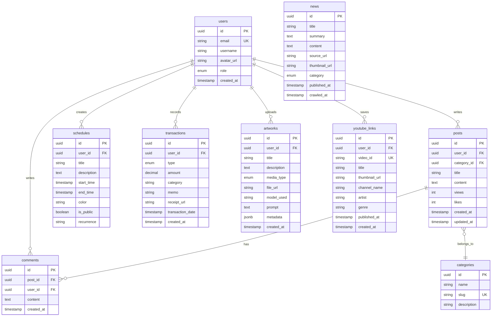

# LLD: metaldragon.co.kr 기술 설계

## 1. 시스템 아키텍처

### 1.1 전체 아키텍처 다이어그램

```
┌─────────────────────────────────────────────────────────────────┐
│                         Client Layer                             │
│  ┌──────────────┐  ┌──────────────┐  ┌──────────────────────┐  │
│  │   Browser    │  │    Mobile    │  │   Search Engines     │  │
│  │  (Desktop)   │  │   (PWA)      │  │   (SEO Crawlers)     │  │
│  └──────────────┘  └──────────────┘  └──────────────────────┘  │
└─────────────────────────────────────────────────────────────────┘
                              ↓ HTTPS
┌─────────────────────────────────────────────────────────────────┐
│                      Cloudflare CDN                              │
│  ┌──────────────────────────────────────────────────────────┐   │
│  │  SSL/TLS │ DDoS Protection │ Caching │ DNS Management   │   │
│  └──────────────────────────────────────────────────────────┘   │
└─────────────────────────────────────────────────────────────────┘
                              ↓
┌─────────────────────────────────────────────────────────────────┐
│                    Next.js Application                           │
│  ┌──────────────────────────────────────────────────────────┐   │
│  │  App Router (RSC)  │  API Routes  │  Middleware         │   │
│  │  - Server Components                                     │   │
│  │  - Client Components (Emotion CSS-in-JS)                 │   │
│  │  - Radix UI Primitives                                   │   │
│  └──────────────────────────────────────────────────────────┘   │
└─────────────────────────────────────────────────────────────────┘
                              ↓
┌─────────────────────────────────────────────────────────────────┐
│                      Supabase Backend                            │
│  ┌───────────────┐  ┌───────────────┐  ┌──────────────────┐    │
│  │   Auth        │  │   Postgres    │  │   Storage        │    │
│  │   (JWT)       │  │   (Drizzle)   │  │   (Images/Files) │    │
│  └───────────────┘  └───────────────┘  └──────────────────┘    │
│  ┌───────────────┐  ┌───────────────┐  ┌──────────────────┐    │
│  │   Realtime    │  │ Edge Functions│  │   RLS Policies   │    │
│  │   (WebSocket) │  │   (Deno)      │  │                  │    │
│  └───────────────┘  └───────────────┘  └──────────────────┘    │
└─────────────────────────────────────────────────────────────────┘
                              ↓
┌─────────────────────────────────────────────────────────────────┐
│                    External Services                             │
│  ┌───────────────┐  ┌───────────────┐  ┌──────────────────┐    │
│  │ Upstash Redis │  │ YouTube API   │  │ News APIs        │    │
│  │ (KV Cache)    │  │               │  │ (RSS Feeds)      │    │
│  └───────────────┘  └───────────────┘  └──────────────────┘    │
│  ┌───────────────┐  ┌───────────────┐  ┌──────────────────┐    │
│  │ Resend/       │  │ IFTTT/Zapier  │  │ Grafana Cloud    │    │
│  │ SendGrid      │  │ (SMS/KakaoTalk│  │ (Monitoring)     │    │
│  └───────────────┘  └───────────────┘  └──────────────────┘    │
└─────────────────────────────────────────────────────────────────┘
                              ↓
┌─────────────────────────────────────────────────────────────────┐
│                    Monitoring Stack                              │
│  ┌──────────────────────────────────────────────────────────┐   │
│  │  Loki (Logs) │ Grafana (Dashboard) │ Promtail (Shipper) │   │
│  └──────────────────────────────────────────────────────────┘   │
└─────────────────────────────────────────────────────────────────┘
```

### 1.2 데이터 플로우

#### 1.2.1 인증 플로우
```
User → Next.js Middleware → Supabase Auth → JWT Token → RLS Policy Check → DB Access
```

#### 1.2.2 뉴스 크롤링 플로우
```
Cron Trigger → Edge Function → External API (News) → Parse & Store → Postgres → Cache (Redis)
```

#### 1.2.3 가계부 자동 입력 플로우
```
SMS/KakaoTalk → IFTTT/Zapier Webhook → Edge Function → Parse (Regex) → Postgres
```

---

## 2. 기술 스택

### 2.1 프론트엔드

#### 2.1.1 프레임워크
- **Next.js 15** (App Router)
  - React Server Components (RSC) 적극 활용
  - Server Actions for Mutations
  - Middleware for Auth Check
  - Image Optimization (next/image)
  - Font Optimization (next/font)

#### 2.1.2 UI/스타일링
- **Emotion 11** (CSS-in-JS)
  - `@emotion/react`, `@emotion/styled`
  - TypeScript 타입 지원
  - Server Component 호환 패턴
- **Radix UI**
  - `@radix-ui/themes` (디자인 토큰)
  - Primitive 컴포넌트 (Dialog, Dropdown, Tooltip 등)
  - 접근성 (WAI-ARIA) 내장
- **Utility Styles (rcss-like)**
  - 커스텀 유틸리티 객체 (padding, margin, flex)
  - TypeScript 타입 안전성
  - 재사용 가능한 스타일 토큰

#### 2.1.3 레이아웃/워크스페이스
- **react-resizable-panels**
  - 스플릿 패널 레이아웃
  - 드래그 리사이징
  - 퍼시스턴트 레이아웃 (localStorage)

#### 2.1.4 상태 관리
- **React Server State**: RSC로 기본 처리
- **Client State**: React Context + useState/useReducer
- **Server State Caching**:
  - `@tanstack/react-query` (Client Components)
  - Upstash Redis (Server-side)

#### 2.1.5 폼 및 유효성 검사
- **react-hook-form**: 폼 관리
- **zod**: 스키마 유효성 검사
- **TypeScript**: 타입 안전성

#### 2.1.6 기타 라이브러리
- **react-markdown**: 마크다운 렌더링
- **react-big-calendar** 또는 **FullCalendar**: 일정 캘린더
- **recharts**: 차트 (가계부 통계)
- **framer-motion**: 애니메이션
- **react-dropzone**: 파일 업로드
- **yet-another-react-lightbox**: 이미지 라이트박스

### 2.2 백엔드

#### 2.2.1 BaaS (Backend as a Service)
- **Supabase**
  - **Auth**: 이메일/소셜 로그인, JWT
  - **Postgres**: 관리형 데이터베이스
  - **Storage**: 파일/이미지 저장
  - **Realtime**: WebSocket Subscriptions
  - **Edge Functions**: Deno 런타임 서버리스 함수
  - **RLS**: Row Level Security

#### 2.2.2 ORM/데이터베이스
- **Drizzle ORM**
  - TypeScript 우선 SQL ORM
  - Supabase Postgres와 완벽 호환
  - Migration 관리
  - 타입 안전한 쿼리 빌더

#### 2.2.3 캐싱/세션
- **Upstash Redis**
  - 서버리스 Redis
  - Rate Limiting
  - 세션 저장
  - 뉴스/크롤링 데이터 캐싱

#### 2.2.4 크롤링/자동화
- **Supabase Edge Functions (Deno)**
  - 뉴스 크롤링 함수
  - YouTube API 호출 함수
  - 이메일 전송 함수
  - 문자/카톡 파싱 함수
- **Cron Jobs**: Supabase Cron 또는 GitHub Actions

### 2.3 인프라/DevOps

#### 2.3.1 호스팅
- **자체 서버** (항상 켜져있는 서버)
  - Docker Compose로 Next.js 컨테이너 실행
  - Nginx Reverse Proxy
  - PM2 프로세스 관리 (대안)

#### 2.3.2 CDN/DNS
- **Cloudflare**
  - SSL/TLS 인증서
  - DDoS 보호
  - CDN 캐싱
  - DNS 관리

#### 2.3.3 컨테이너
- **Dev Containers**
  - `.devcontainer/devcontainer.json`
  - 표준화된 개발 환경
  - VS Code Remote Containers 지원

#### 2.3.4 모니터링/로깅
- **Loki + Grafana + Promtail**
  - Loki: 로그 수집 및 저장
  - Grafana: 대시보드 및 시각화
  - Promtail: 로그 전송 에이전트
- **Sentry** (선택사항): 에러 트래킹

### 2.4 외부 API/서비스

#### 2.4.1 뉴스 API
- **AI 뉴스**:
  - TechCrunch RSS
  - VentureBeat RSS
  - Hacker News API
- **코인 뉴스**:
  - CoinDesk RSS
  - CoinTelegraph RSS
  - Upbit/Bithumb 공지사항 (웹 스크래핑)

#### 2.4.2 YouTube API
- **YouTube Data API v3**
  - 채널/플레이리스트 조회
  - 비디오 메타데이터

#### 2.4.3 이메일 전송
- **Resend** (권장)
  - React Email 템플릿 지원
  - 쉬운 API
- **SendGrid** (대안)

#### 2.4.4 문자/카톡 연동
- **IFTTT** 또는 **Zapier**
  - SMS Forwarding to Webhook
  - KakaoTalk Notification to Webhook
- **Twilio** (대안, 유료)

#### 2.4.5 기타
- **reCAPTCHA v3**: 스팸 방지
- **Google Analytics**: 방문자 통계

---

## 3. 데이터베이스 설계

### 3.1 스키마 다이어그램



### 3.2 테이블 정의 (Drizzle Schema)

#### 3.2.1 users (사용자)

```typescript
// schema/users.ts
import { pgTable, uuid, varchar, text, timestamp, pgEnum } from 'drizzle-orm/pg-core';

export const roleEnum = pgEnum('user_role', ['admin', 'user']);

export const users = pgTable('users', {
  id: uuid('id').primaryKey().defaultRandom(),
  email: varchar('email', { length: 255 }).notNull().unique(),
  username: varchar('username', { length: 50 }).notNull(),
  avatarUrl: text('avatar_url'),
  role: roleEnum('role').notNull().default('user'),
  createdAt: timestamp('created_at').notNull().defaultNow(),
  updatedAt: timestamp('updated_at').notNull().defaultNow(),
});
```

**RLS Policy**:
```sql
-- 모든 사용자는 자신의 정보만 조회/수정 가능
CREATE POLICY "Users can view their own data"
  ON users FOR SELECT
  USING (auth.uid() = id);

-- 관리자는 모든 사용자 조회 가능
CREATE POLICY "Admins can view all users"
  ON users FOR SELECT
  USING (EXISTS (
    SELECT 1 FROM users WHERE id = auth.uid() AND role = 'admin'
  ));
```

#### 3.2.2 categories (카테고리)

```typescript
// schema/categories.ts
export const categories = pgTable('categories', {
  id: uuid('id').primaryKey().defaultRandom(),
  name: varchar('name', { length: 100 }).notNull(),
  slug: varchar('slug', { length: 100 }).notNull().unique(),
  description: text('description'),
  createdAt: timestamp('created_at').notNull().defaultNow(),
});

// 기본 카테고리 Seed Data
// - ai_study (AI 스터디)
// - bigdata_study (빅데이터처리기사 스터디)
// - free_board (자유게시판)
// - ai_artwork (AI 작품)
```

#### 3.2.3 posts (게시글)

```typescript
// schema/posts.ts
export const posts = pgTable('posts', {
  id: uuid('id').primaryKey().defaultRandom(),
  userId: uuid('user_id').notNull().references(() => users.id),
  categoryId: uuid('category_id').notNull().references(() => categories.id),
  title: varchar('title', { length: 255 }).notNull(),
  content: text('content').notNull(),
  views: integer('views').notNull().default(0),
  likes: integer('likes').notNull().default(0),
  createdAt: timestamp('created_at').notNull().defaultNow(),
  updatedAt: timestamp('updated_at').notNull().defaultNow(),
});
```

**RLS Policy**:
```sql
-- 모든 사용자는 게시글 조회 가능
CREATE POLICY "Posts are viewable by everyone"
  ON posts FOR SELECT
  USING (true);

-- 로그인 사용자는 게시글 작성 가능
CREATE POLICY "Authenticated users can create posts"
  ON posts FOR INSERT
  WITH CHECK (auth.uid() IS NOT NULL);

-- 작성자는 자신의 게시글 수정/삭제 가능
CREATE POLICY "Users can update their own posts"
  ON posts FOR UPDATE
  USING (auth.uid() = user_id);
```

#### 3.2.4 comments (댓글)

```typescript
// schema/comments.ts
export const comments = pgTable('comments', {
  id: uuid('id').primaryKey().defaultRandom(),
  postId: uuid('post_id').notNull().references(() => posts.id, { onDelete: 'cascade' }),
  userId: uuid('user_id').notNull().references(() => users.id),
  content: text('content').notNull(),
  createdAt: timestamp('created_at').notNull().defaultNow(),
});
```

#### 3.2.5 schedules (일정)

```typescript
// schema/schedules.ts
export const recurrenceEnum = pgEnum('recurrence', ['none', 'daily', 'weekly', 'monthly']);

export const schedules = pgTable('schedules', {
  id: uuid('id').primaryKey().defaultRandom(),
  userId: uuid('user_id').notNull().references(() => users.id),
  title: varchar('title', { length: 255 }).notNull(),
  description: text('description'),
  startTime: timestamp('start_time').notNull(),
  endTime: timestamp('end_time').notNull(),
  color: varchar('color', { length: 7 }).notNull().default('#3b82f6'), // HEX color
  isPublic: boolean('is_public').notNull().default(false),
  recurrence: recurrenceEnum('recurrence').notNull().default('none'),
  createdAt: timestamp('created_at').notNull().defaultNow(),
});
```

**RLS Policy**:
```sql
-- 공개 일정은 모두 조회 가능, 비공개는 본인만
CREATE POLICY "Schedules are viewable based on privacy"
  ON schedules FOR SELECT
  USING (is_public = true OR auth.uid() = user_id);
```

#### 3.2.6 transactions (가계부)

```typescript
// schema/transactions.ts
export const transactionTypeEnum = pgEnum('transaction_type', ['income', 'expense']);

export const transactions = pgTable('transactions', {
  id: uuid('id').primaryKey().defaultRandom(),
  userId: uuid('user_id').notNull().references(() => users.id),
  type: transactionTypeEnum('type').notNull(),
  amount: decimal('amount', { precision: 12, scale: 2 }).notNull(),
  category: varchar('category', { length: 50 }).notNull(),
  memo: text('memo'),
  receiptUrl: text('receipt_url'),
  transactionDate: timestamp('transaction_date').notNull(),
  createdAt: timestamp('created_at').notNull().defaultNow(),
});
```

#### 3.2.7 news (뉴스)

```typescript
// schema/news.ts
export const newsCategoryEnum = pgEnum('news_category', ['ai', 'crypto', 'general']);

export const news = pgTable('news', {
  id: uuid('id').primaryKey().defaultRandom(),
  title: varchar('title', { length: 500 }).notNull(),
  summary: text('summary'),
  content: text('content'),
  sourceUrl: text('source_url').notNull().unique(),
  thumbnailUrl: text('thumbnail_url'),
  category: newsCategoryEnum('category').notNull(),
  publishedAt: timestamp('published_at').notNull(),
  crawledAt: timestamp('crawled_at').notNull().defaultNow(),
});
```

**RLS Policy**:
```sql
-- 뉴스는 모두 조회 가능
CREATE POLICY "News are viewable by everyone"
  ON news FOR SELECT
  USING (true);

-- Edge Function만 뉴스 삽입 가능 (Service Role Key 사용)
```

#### 3.2.8 artworks (AI 작품)

```typescript
// schema/artworks.ts
export const mediaTypeEnum = pgEnum('media_type', ['image', 'video', 'audio', 'document']);

export const artworks = pgTable('artworks', {
  id: uuid('id').primaryKey().defaultRandom(),
  userId: uuid('user_id').notNull().references(() => users.id),
  title: varchar('title', { length: 255 }).notNull(),
  description: text('description'),
  mediaType: mediaTypeEnum('media_type').notNull(),
  fileUrl: text('file_url').notNull(),
  modelUsed: varchar('model_used', { length: 100 }), // e.g., "DALL-E 3", "Midjourney v6"
  prompt: text('prompt'),
  metadata: jsonb('metadata'), // { resolution: "1024x1024", steps: 50, ... }
  createdAt: timestamp('created_at').notNull().defaultNow(),
});
```

#### 3.2.9 youtube_links (유튜브 링크)

```typescript
// schema/youtube_links.ts
export const youtubeLinks = pgTable('youtube_links', {
  id: uuid('id').primaryKey().defaultRandom(),
  userId: uuid('user_id').notNull().references(() => users.id),
  videoId: varchar('video_id', { length: 20 }).notNull().unique(),
  title: varchar('title', { length: 255 }).notNull(),
  thumbnailUrl: text('thumbnail_url').notNull(),
  channelName: varchar('channel_name', { length: 100 }),
  artist: varchar('artist', { length: 100 }),
  genre: varchar('genre', { length: 50 }),
  publishedAt: timestamp('published_at').notNull(),
  createdAt: timestamp('created_at').notNull().defaultNow(),
});
```

### 3.3 인덱스 전략

```sql
-- 성능 최적화를 위한 인덱스
CREATE INDEX idx_posts_user_id ON posts(user_id);
CREATE INDEX idx_posts_category_id ON posts(category_id);
CREATE INDEX idx_posts_created_at ON posts(created_at DESC);
CREATE INDEX idx_comments_post_id ON comments(post_id);
CREATE INDEX idx_schedules_user_id ON schedules(user_id);
CREATE INDEX idx_schedules_start_time ON schedules(start_time);
CREATE INDEX idx_transactions_user_id ON transactions(user_id);
CREATE INDEX idx_transactions_date ON transactions(transaction_date DESC);
CREATE INDEX idx_news_category ON news(category);
CREATE INDEX idx_news_published_at ON news(published_at DESC);
CREATE INDEX idx_artworks_user_id ON artworks(user_id);
CREATE INDEX idx_youtube_links_user_id ON youtube_links(user_id);
```

---

## 4. API 설계

### 4.1 인증 API (Supabase Auth)

#### 4.1.1 회원가입
```typescript
// POST /auth/signup
// Supabase Client SDK 사용
const { data, error } = await supabase.auth.signUp({
  email: 'user@example.com',
  password: 'securePassword123',
  options: {
    data: {
      username: 'johndoe',
    },
  },
});
```

#### 4.1.2 로그인
```typescript
// POST /auth/login
const { data, error } = await supabase.auth.signInWithPassword({
  email: 'user@example.com',
  password: 'securePassword123',
});
```

#### 4.1.3 소셜 로그인
```typescript
// POST /auth/login/google
const { data, error } = await supabase.auth.signInWithOAuth({
  provider: 'google',
  options: {
    redirectTo: 'https://metaldragon.co.kr/auth/callback',
  },
});
```

### 4.2 게시판 API (Next.js API Routes)

#### 4.2.1 게시글 목록 조회
```typescript
// GET /api/posts?category=ai_study&page=1&limit=20
export async function GET(request: Request) {
  const { searchParams } = new URL(request.url);
  const category = searchParams.get('category');
  const page = parseInt(searchParams.get('page') || '1');
  const limit = parseInt(searchParams.get('limit') || '20');

  const posts = await db
    .select()
    .from(postsTable)
    .where(eq(postsTable.categoryId, categoryId))
    .orderBy(desc(postsTable.createdAt))
    .limit(limit)
    .offset((page - 1) * limit);

  return Response.json({ posts, page, limit });
}
```

#### 4.2.2 게시글 작성
```typescript
// POST /api/posts
export async function POST(request: Request) {
  const session = await getSession();
  if (!session) return Response.json({ error: 'Unauthorized' }, { status: 401 });

  const { title, content, categoryId } = await request.json();

  const [post] = await db
    .insert(postsTable)
    .values({
      userId: session.user.id,
      categoryId,
      title,
      content,
    })
    .returning();

  return Response.json({ post }, { status: 201 });
}
```

### 4.3 일정 API

#### 4.3.1 일정 조회
```typescript
// GET /api/schedules?start=2025-10-01&end=2025-10-31
export async function GET(request: Request) {
  const { searchParams } = new URL(request.url);
  const start = searchParams.get('start');
  const end = searchParams.get('end');

  const schedules = await db
    .select()
    .from(schedulesTable)
    .where(
      and(
        gte(schedulesTable.startTime, new Date(start)),
        lte(schedulesTable.endTime, new Date(end))
      )
    );

  return Response.json({ schedules });
}
```

### 4.4 가계부 API

#### 4.4.1 거래 내역 조회
```typescript
// GET /api/transactions?year=2025&month=10
export async function GET(request: Request) {
  const session = await getSession();
  const { searchParams } = new URL(request.url);
  const year = searchParams.get('year');
  const month = searchParams.get('month');

  const transactions = await db
    .select()
    .from(transactionsTable)
    .where(
      and(
        eq(transactionsTable.userId, session.user.id),
        sql`EXTRACT(YEAR FROM transaction_date) = ${year}`,
        sql`EXTRACT(MONTH FROM transaction_date) = ${month}`
      )
    );

  return Response.json({ transactions });
}
```

#### 4.4.2 통계 조회
```typescript
// GET /api/transactions/stats?year=2025&month=10
export async function GET(request: Request) {
  // 월별 카테고리별 지출 합계
  const stats = await db
    .select({
      category: transactionsTable.category,
      totalAmount: sql<number>`SUM(amount)`,
      count: sql<number>`COUNT(*)`,
    })
    .from(transactionsTable)
    .where(/* ... */)
    .groupBy(transactionsTable.category);

  return Response.json({ stats });
}
```

### 4.5 뉴스 API

#### 4.5.1 뉴스 목록 조회
```typescript
// GET /api/news?category=ai&page=1&limit=20
export async function GET(request: Request) {
  // Redis 캐싱 체크
  const cached = await redis.get(`news:${category}:${page}`);
  if (cached) return Response.json(JSON.parse(cached));

  const news = await db
    .select()
    .from(newsTable)
    .where(eq(newsTable.category, category))
    .orderBy(desc(newsTable.publishedAt))
    .limit(limit)
    .offset((page - 1) * limit);

  // 캐시 저장 (1시간)
  await redis.setex(`news:${category}:${page}`, 3600, JSON.stringify(news));

  return Response.json({ news });
}
```

### 4.6 Edge Functions API (Supabase)

#### 4.6.1 뉴스 크롤러
```typescript
// supabase/functions/crawl-news/index.ts
import { serve } from 'https://deno.land/std@0.168.0/http/server.ts';
import { createClient } from 'https://esm.sh/@supabase/supabase-js@2';

serve(async (req) => {
  const supabase = createClient(
    Deno.env.get('SUPABASE_URL')!,
    Deno.env.get('SUPABASE_SERVICE_ROLE_KEY')!
  );

  // AI 뉴스 크롤링
  const aiNews = await fetchAINews(); // TechCrunch, VentureBeat RSS
  const cryptoNews = await fetchCryptoNews(); // CoinDesk, CoinTelegraph RSS

  // DB에 저장
  const { data, error } = await supabase
    .from('news')
    .upsert([...aiNews, ...cryptoNews], { onConflict: 'source_url' });

  return new Response(JSON.stringify({ success: true, count: data?.length }), {
    headers: { 'Content-Type': 'application/json' },
  });
});
```

#### 4.6.2 유튜브 크롤러
```typescript
// supabase/functions/crawl-youtube/index.ts
serve(async (req) => {
  const YOUTUBE_API_KEY = Deno.env.get('YOUTUBE_API_KEY');
  const playlistId = 'PLxxxxxx'; // 커버 플레이리스트 ID

  const response = await fetch(
    `https://www.googleapis.com/youtube/v3/playlistItems?part=snippet&playlistId=${playlistId}&maxResults=50&key=${YOUTUBE_API_KEY}`
  );

  const { items } = await response.json();

  const links = items.map((item: any) => ({
    video_id: item.snippet.resourceId.videoId,
    title: item.snippet.title,
    thumbnail_url: item.snippet.thumbnails.high.url,
    published_at: item.snippet.publishedAt,
  }));

  await supabase.from('youtube_links').upsert(links, { onConflict: 'video_id' });

  return new Response(JSON.stringify({ success: true }));
});
```

#### 4.6.3 문자 메시지 파싱
```typescript
// supabase/functions/parse-sms/index.ts
serve(async (req) => {
  const { message, timestamp } = await req.json();

  // 정규식으로 카드 사용 내역 파싱
  const regex = /(\d{1,3}(,\d{3})*원).*([\w\s가-힣]+)/;
  const match = message.match(regex);

  if (match) {
    const amount = parseFloat(match[1].replace(/,|원/g, ''));
    const merchant = match[3].trim();

    await supabase.from('transactions').insert({
      user_id: 'admin-user-id', // 관리자 ID
      type: 'expense',
      amount,
      category: '자동입력',
      memo: message,
      transaction_date: timestamp,
    });
  }

  return new Response(JSON.stringify({ success: true }));
});
```

#### 4.6.4 이메일 전송
```typescript
// supabase/functions/send-email/index.ts
import { Resend } from 'https://esm.sh/resend@2.0.0';

serve(async (req) => {
  const { name, email, subject, message } = await req.json();

  const resend = new Resend(Deno.env.get('RESEND_API_KEY'));

  const { data, error } = await resend.emails.send({
    from: 'contact@metaldragon.co.kr',
    to: 'admin@metaldragon.co.kr',
    subject: `[문의] ${subject}`,
    html: `
      <h2>새로운 문의가 도착했습니다</h2>
      <p><strong>이름:</strong> ${name}</p>
      <p><strong>이메일:</strong> ${email}</p>
      <p><strong>내용:</strong></p>
      <p>${message}</p>
    `,
  });

  return new Response(JSON.stringify({ success: !error }));
});
```

---

## 5. 컴포넌트 구조

### 5.1 디자인 시스템 (RUI-like)

#### 5.1.1 기본 컴포넌트
```typescript
// components/ui/View.tsx
import styled from '@emotion/styled';
import { HTMLAttributes } from 'react';

interface ViewProps extends HTMLAttributes<HTMLDivElement> {
  flex?: boolean;
  direction?: 'row' | 'column';
  align?: 'start' | 'center' | 'end';
  justify?: 'start' | 'center' | 'end' | 'between';
  gap?: number;
  padding?: number;
}

export const View = styled.div<ViewProps>`
  ${(props) => props.flex && `display: flex;`}
  ${(props) => props.direction && `flex-direction: ${props.direction};`}
  ${(props) => props.align && `align-items: ${props.align};`}
  ${(props) => props.justify && `justify-content: ${props.justify};`}
  ${(props) => props.gap && `gap: ${props.gap}px;`}
  ${(props) => props.padding && `padding: ${props.padding}px;`}
`;
```

#### 5.1.2 유틸리티 스타일 (rcss-like)
```typescript
// lib/styles/rcss.ts
export const rcss = {
  flex: (direction: 'row' | 'column' = 'row') => ({
    display: 'flex',
    flexDirection: direction,
  }),

  center: {
    display: 'flex',
    alignItems: 'center',
    justifyContent: 'center',
  },

  p: (value: number) => ({
    padding: `${value * 4}px`, // 4px 단위
  }),

  m: (value: number) => ({
    margin: `${value * 4}px`,
  }),

  gap: (value: number) => ({
    gap: `${value * 4}px`,
  }),
};

// 사용 예시
<View css={[rcss.flex('column'), rcss.gap(4), rcss.p(6)]}>
  {/* content */}
</View>
```

#### 5.1.3 디자인 토큰
```typescript
// lib/styles/tokens.ts
export const tokens = {
  colors: {
    primary: '#3b82f6',
    secondary: '#8b5cf6',
    success: '#10b981',
    danger: '#ef4444',
    warning: '#f59e0b',
    gray: {
      50: '#f9fafb',
      100: '#f3f4f6',
      200: '#e5e7eb',
      // ...
      900: '#111827',
    },
  },

  spacing: {
    xs: '4px',
    sm: '8px',
    md: '16px',
    lg: '24px',
    xl: '32px',
  },

  typography: {
    fontFamily: {
      sans: 'Inter, -apple-system, sans-serif',
      mono: 'JetBrains Mono, monospace',
    },
    fontSize: {
      xs: '0.75rem',
      sm: '0.875rem',
      base: '1rem',
      lg: '1.125rem',
      xl: '1.25rem',
      '2xl': '1.5rem',
      '3xl': '1.875rem',
    },
  },

  borderRadius: {
    sm: '4px',
    md: '8px',
    lg: '12px',
    full: '9999px',
  },
};
```

### 5.2 페이지 컴포넌트 구조

#### 5.2.1 홈페이지
```typescript
// app/page.tsx (Server Component)
import { Hero } from '@/components/home/Hero';
import { LatestNews } from '@/components/home/LatestNews';
import { LatestPosts } from '@/components/home/LatestPosts';

export default async function HomePage() {
  const news = await getLatestNews(); // Server-side fetch
  const posts = await getLatestPosts();

  return (
    <>
      <Hero />
      <LatestNews news={news} />
      <LatestPosts posts={posts} />
    </>
  );
}
```

#### 5.2.2 게시판
```typescript
// app/board/[slug]/page.tsx
export default async function BoardPage({ params }: { params: { slug: string } }) {
  const category = await getCategoryBySlug(params.slug);
  const posts = await getPostsByCategory(category.id);

  return (
    <div>
      <BoardHeader category={category} />
      <PostList posts={posts} />
      <Pagination />
    </div>
  );
}
```

#### 5.2.3 일정 관리
```typescript
// app/schedule/page.tsx (Client Component)
'use client';

import { Calendar } from '@/components/schedule/Calendar';
import { useSchedules } from '@/hooks/useSchedules';

export default function SchedulePage() {
  const { schedules, addSchedule, updateSchedule, deleteSchedule } = useSchedules();

  return (
    <Calendar
      schedules={schedules}
      onAdd={addSchedule}
      onUpdate={updateSchedule}
      onDelete={deleteSchedule}
    />
  );
}
```

### 5.3 레이아웃 컴포넌트

#### 5.3.1 루트 레이아웃
```typescript
// app/layout.tsx
import { Header } from '@/components/layout/Header';
import { Footer } from '@/components/layout/Footer';
import { Sidebar } from '@/components/layout/Sidebar';

export default function RootLayout({ children }: { children: React.ReactNode }) {
  return (
    <html lang="ko">
      <body>
        <Header />
        <div style={{ display: 'flex' }}>
          <Sidebar />
          <main style={{ flex: 1 }}>{children}</main>
        </div>
        <Footer />
      </body>
    </html>
  );
}
```

#### 5.3.2 리사이저블 패널 레이아웃
```typescript
// components/layout/ResizableLayout.tsx
'use client';

import { Panel, PanelGroup, PanelResizeHandle } from 'react-resizable-panels';

export function ResizableLayout() {
  return (
    <PanelGroup direction="horizontal">
      <Panel defaultSize={20} minSize={15}>
        <Sidebar />
      </Panel>
      <PanelResizeHandle />
      <Panel defaultSize={80}>
        <MainContent />
      </Panel>
    </PanelGroup>
  );
}
```

---

## 6. 파일 구조

```
metaldragon.co.kr/
├── .devcontainer/
│   └── devcontainer.json          # Dev Container 설정
├── app/                            # Next.js App Router
│   ├── (auth)/                     # Auth 그룹 라우트
│   │   ├── login/
│   │   │   └── page.tsx
│   │   └── signup/
│   │       └── page.tsx
│   ├── (dashboard)/                # 대시보드 그룹 (관리자)
│   │   ├── admin/
│   │   │   ├── page.tsx            # 관리자 홈
│   │   │   ├── users/
│   │   │   └── stats/
│   ├── about/
│   │   └── page.tsx                # 자기소개
│   ├── board/
│   │   ├── [slug]/
│   │   │   ├── page.tsx            # 게시판 목록
│   │   │   └── [id]/
│   │   │       └── page.tsx        # 게시글 상세
│   ├── schedule/
│   │   └── page.tsx                # 일정 관리
│   ├── budget/
│   │   └── page.tsx                # 가계부
│   ├── news/
│   │   └── page.tsx                # IT 뉴스
│   ├── artworks/
│   │   └── page.tsx                # AI 작품 갤러리
│   ├── youtube/
│   │   └── page.tsx                # 유튜브 커버 링크
│   ├── contact/
│   │   └── page.tsx                # 문의하기
│   ├── api/                        # API Routes
│   │   ├── posts/
│   │   │   └── route.ts
│   │   ├── schedules/
│   │   │   └── route.ts
│   │   ├── transactions/
│   │   │   └── route.ts
│   │   └── news/
│   │       └── route.ts
│   ├── layout.tsx                  # 루트 레이아웃
│   ├── page.tsx                    # 홈페이지
│   └── globals.css
├── components/
│   ├── ui/                         # 기본 UI 컴포넌트
│   │   ├── View.tsx
│   │   ├── Button.tsx
│   │   ├── Input.tsx
│   │   ├── Card.tsx
│   │   └── Modal.tsx
│   ├── layout/                     # 레이아웃 컴포넌트
│   │   ├── Header.tsx
│   │   ├── Footer.tsx
│   │   ├── Sidebar.tsx
│   │   └── ResizableLayout.tsx
│   ├── home/                       # 홈 페이지 컴포넌트
│   │   ├── Hero.tsx
│   │   ├── LatestNews.tsx
│   │   └── LatestPosts.tsx
│   ├── board/                      # 게시판 컴포넌트
│   │   ├── PostList.tsx
│   │   ├── PostCard.tsx
│   │   ├── PostEditor.tsx
│   │   └── CommentSection.tsx
│   ├── schedule/                   # 일정 컴포넌트
│   │   ├── Calendar.tsx
│   │   └── EventModal.tsx
│   ├── budget/                     # 가계부 컴포넌트
│   │   ├── TransactionList.tsx
│   │   ├── TransactionForm.tsx
│   │   └── StatsChart.tsx
│   └── admin/                      # 관리자 컴포넌트
│       ├── Dashboard.tsx
│       └── UserTable.tsx
├── lib/
│   ├── supabase/
│   │   ├── client.ts               # Supabase Client
│   │   ├── server.ts               # Supabase Server Client
│   │   └── middleware.ts           # Auth Middleware
│   ├── db/
│   │   ├── drizzle.ts              # Drizzle 설정
│   │   ├── schema/                 # DB 스키마
│   │   │   ├── users.ts
│   │   │   ├── posts.ts
│   │   │   ├── schedules.ts
│   │   │   ├── transactions.ts
│   │   │   ├── news.ts
│   │   │   └── index.ts
│   │   └── queries/                # Query 함수
│   │       ├── posts.ts
│   │       ├── schedules.ts
│   │       └── transactions.ts
│   ├── redis/
│   │   └── client.ts               # Upstash Redis
│   ├── styles/
│   │   ├── tokens.ts               # 디자인 토큰
│   │   ├── rcss.ts                 # 유틸리티 스타일
│   │   └── theme.ts                # Emotion 테마
│   └── utils/
│       ├── cn.ts                   # className 유틸
│       ├── date.ts                 # 날짜 포맷
│       └── validation.ts           # Zod 스키마
├── hooks/
│   ├── useAuth.ts                  # 인증 훅
│   ├── usePosts.ts                 # 게시글 훅
│   ├── useSchedules.ts             # 일정 훅
│   └── useTransactions.ts          # 가계부 훅
├── supabase/
│   ├── functions/                  # Edge Functions
│   │   ├── crawl-news/
│   │   │   └── index.ts
│   │   ├── crawl-youtube/
│   │   │   └── index.ts
│   │   ├── parse-sms/
│   │   │   └── index.ts
│   │   └── send-email/
│   │       └── index.ts
│   ├── migrations/                 # DB Migrations
│   │   ├── 0001_initial.sql
│   │   └── 0002_add_news.sql
│   └── seed.sql                    # Seed 데이터
├── public/
│   ├── images/
│   ├── icons/
│   └── fonts/
├── .env.local                      # 환경변수
├── .gitignore
├── docker-compose.yml              # Loki + Grafana
├── drizzle.config.ts               # Drizzle 설정
├── next.config.js
├── package.json
├── tsconfig.json
├── PLAN.md                         # 구현 계획
├── PRD.md                          # 제품 요구사항
└── LLD.md                          # 기술 설계 (이 문서)
```

---

## 7. 외부 서비스 연동

### 7.1 뉴스 크롤링

#### 7.1.1 AI 뉴스 출처
- **TechCrunch AI**: https://techcrunch.com/category/artificial-intelligence/feed/
- **VentureBeat AI**: https://venturebeat.com/category/ai/feed/
- **MIT Technology Review**: https://www.technologyreview.com/feed/

#### 7.1.2 코인 뉴스 출처
- **CoinDesk**: https://www.coindesk.com/arc/outboundfeeds/rss/
- **CoinTelegraph**: https://cointelegraph.com/rss
- **업비트 공지사항**: 웹 스크래핑 (Cheerio/Deno DOM)

#### 7.1.3 크롤링 로직
```typescript
// supabase/functions/crawl-news/parser.ts
import { DOMParser } from 'https://deno.land/x/deno_dom/deno-dom-wasm.ts';

async function parseRSS(url: string, category: 'ai' | 'crypto') {
  const response = await fetch(url);
  const xml = await response.text();

  const doc = new DOMParser().parseFromString(xml, 'text/xml');
  const items = doc.querySelectorAll('item');

  return Array.from(items).map((item) => ({
    title: item.querySelector('title')?.textContent || '',
    summary: item.querySelector('description')?.textContent || '',
    source_url: item.querySelector('link')?.textContent || '',
    thumbnail_url: item.querySelector('media\\:thumbnail')?.getAttribute('url') || null,
    category,
    published_at: new Date(item.querySelector('pubDate')?.textContent || ''),
  }));
}
```

### 7.2 YouTube API 연동

#### 7.2.1 API 키 발급
- Google Cloud Console에서 YouTube Data API v3 활성화
- API 키 생성 후 환경변수에 저장

#### 7.2.2 플레이리스트 조회
```typescript
// supabase/functions/crawl-youtube/youtube.ts
async function fetchPlaylistItems(playlistId: string, apiKey: string) {
  const url = `https://www.googleapis.com/youtube/v3/playlistItems?part=snippet&playlistId=${playlistId}&maxResults=50&key=${apiKey}`;

  const response = await fetch(url);
  const data = await response.json();

  return data.items.map((item: any) => ({
    video_id: item.snippet.resourceId.videoId,
    title: item.snippet.title,
    thumbnail_url: item.snippet.thumbnails.high.url,
    channel_name: item.snippet.channelTitle,
    published_at: item.snippet.publishedAt,
  }));
}
```

### 7.3 문자/카톡 연동 (IFTTT)

#### 7.3.1 IFTTT Applet 설정
1. **Trigger**: Android SMS received (또는 Notification received)
2. **Action**: Webhook POST
   - URL: `https://[project-id].supabase.co/functions/v1/parse-sms`
   - Method: POST
   - Body: `{ "message": "{{Text}}", "timestamp": "{{OccurredAt}}" }`

#### 7.3.2 파싱 정규식
```typescript
// 카드 사용 내역 패턴
const cardPatterns = {
  // 신한카드: "[신한카드] 12,345원 승인 ABC마트"
  shinhan: /\[신한카드\]\s*([\d,]+원)\s*승인\s*(.+)/,

  // 삼성카드: "삼성카드 12,345원 승인(ABC마트)"
  samsung: /삼성카드\s*([\d,]+원)\s*승인\((.+)\)/,

  // 카카오페이: "[카카오페이] 12,345원 결제완료 ABC마트"
  kakaopay: /\[카카오페이\]\s*([\d,]+원)\s*결제완료\s*(.+)/,
};

function parseMessage(message: string) {
  for (const [bank, regex] of Object.entries(cardPatterns)) {
    const match = message.match(regex);
    if (match) {
      return {
        amount: parseFloat(match[1].replace(/,|원/g, '')),
        merchant: match[2].trim(),
        source: bank,
      };
    }
  }
  return null;
}
```

### 7.4 이메일 전송 (Resend)

#### 7.4.1 React Email 템플릿
```typescript
// emails/ContactEmail.tsx
import { Html, Head, Body, Container, Text, Button } from '@react-email/components';

export default function ContactEmail({ name, email, message }: Props) {
  return (
    <Html>
      <Head />
      <Body style={{ fontFamily: 'sans-serif' }}>
        <Container>
          <Text>새로운 문의가 도착했습니다.</Text>
          <Text><strong>이름:</strong> {name}</Text>
          <Text><strong>이메일:</strong> {email}</Text>
          <Text><strong>내용:</strong></Text>
          <Text>{message}</Text>
          <Button href={`mailto:${email}`}>답장하기</Button>
        </Container>
      </Body>
    </Html>
  );
}
```

---

## 8. 보안 설계

### 8.1 인증/인가

#### 8.1.1 Supabase Auth Flow
1. 사용자가 이메일/비밀번호 또는 소셜 로그인
2. Supabase Auth가 JWT 토큰 발급
3. Next.js Middleware에서 토큰 검증
4. RLS Policy가 DB 접근 제어

#### 8.1.2 Middleware 구현
```typescript
// middleware.ts
import { createMiddlewareClient } from '@supabase/auth-helpers-nextjs';
import { NextResponse } from 'next/server';
import type { NextRequest } from 'next/server';

export async function middleware(req: NextRequest) {
  const res = NextResponse.next();
  const supabase = createMiddlewareClient({ req, res });

  const {
    data: { session },
  } = await supabase.auth.getSession();

  // 관리자 페이지 접근 제어
  if (req.nextUrl.pathname.startsWith('/admin')) {
    if (!session) {
      return NextResponse.redirect(new URL('/login', req.url));
    }

    const { data: user } = await supabase
      .from('users')
      .select('role')
      .eq('id', session.user.id)
      .single();

    if (user?.role !== 'admin') {
      return NextResponse.redirect(new URL('/', req.url));
    }
  }

  return res;
}

export const config = {
  matcher: ['/admin/:path*', '/schedule/:path*', '/budget/:path*'],
};
```

### 8.2 RLS 정책

#### 8.2.1 예시: 게시글 RLS
```sql
-- 읽기: 모두 가능
CREATE POLICY "Anyone can read posts"
  ON posts FOR SELECT
  USING (true);

-- 쓰기: 인증된 사용자만
CREATE POLICY "Authenticated users can create posts"
  ON posts FOR INSERT
  WITH CHECK (auth.uid() IS NOT NULL);

-- 수정: 작성자 또는 관리자만
CREATE POLICY "Users can update own posts or admins can update any"
  ON posts FOR UPDATE
  USING (
    auth.uid() = user_id
    OR EXISTS (
      SELECT 1 FROM users
      WHERE id = auth.uid() AND role = 'admin'
    )
  );

-- 삭제: 작성자 또는 관리자만
CREATE POLICY "Users can delete own posts or admins can delete any"
  ON posts FOR DELETE
  USING (
    auth.uid() = user_id
    OR EXISTS (
      SELECT 1 FROM users
      WHERE id = auth.uid() AND role = 'admin'
    )
  );
```

### 8.3 Rate Limiting

#### 8.3.1 Upstash Redis 기반
```typescript
// lib/redis/rate-limit.ts
import { Redis } from '@upstash/redis';

const redis = new Redis({
  url: process.env.UPSTASH_REDIS_REST_URL!,
  token: process.env.UPSTASH_REDIS_REST_TOKEN!,
});

export async function rateLimit(identifier: string, limit: number, window: number) {
  const key = `rate-limit:${identifier}`;
  const current = await redis.incr(key);

  if (current === 1) {
    await redis.expire(key, window);
  }

  return {
    success: current <= limit,
    remaining: Math.max(0, limit - current),
  };
}

// 사용 예시
export async function POST(req: Request) {
  const ip = req.headers.get('x-forwarded-for') || 'anonymous';
  const { success } = await rateLimit(ip, 10, 60); // 분당 10회

  if (!success) {
    return Response.json({ error: 'Too many requests' }, { status: 429 });
  }

  // 정상 처리
}
```

### 8.4 환경변수 관리

#### 8.4.1 .env.local 구조
```bash
# Supabase
NEXT_PUBLIC_SUPABASE_URL=https://xhzqhvjkkfpeavdphoit.supabase.co
NEXT_PUBLIC_SUPABASE_ANON_KEY=eyJhbGci...
SUPABASE_SERVICE_ROLE_KEY=eyJhbGci... # 절대 클라이언트에 노출 금지

# Upstash Redis
UPSTASH_REDIS_REST_URL=https://...
UPSTASH_REDIS_REST_TOKEN=...

# External APIs
YOUTUBE_API_KEY=AIza...
RESEND_API_KEY=re_...

# IFTTT Webhooks
IFTTT_WEBHOOK_KEY=...

# Monitoring
GRAFANA_API_KEY=...
```

---

## 9. 성능 최적화 전략

### 9.1 이미지 최적화

#### 9.1.1 Next.js Image 컴포넌트
```typescript
import Image from 'next/image';

<Image
  src="/profile.jpg"
  alt="Profile"
  width={300}
  height={300}
  placeholder="blur"
  blurDataURL="data:image/..." // 저화질 프리뷰
/>
```

#### 9.1.2 Supabase Storage 변환
```typescript
// 썸네일 생성 (Supabase Storage Transformation)
const thumbnailUrl = supabase.storage
  .from('images')
  .getPublicUrl('photo.jpg', {
    transform: {
      width: 400,
      height: 400,
      resize: 'cover',
      format: 'webp',
    },
  }).data.publicUrl;
```

### 9.2 코드 스플리팅

#### 9.2.1 동적 임포트
```typescript
// 무거운 컴포넌트를 동적으로 로드
import dynamic from 'next/dynamic';

const HeavyChart = dynamic(() => import('@/components/budget/StatsChart'), {
  loading: () => <p>차트 로딩 중...</p>,
  ssr: false, // 클라이언트에서만 렌더링
});
```

### 9.3 캐싱 전략

#### 9.3.1 Redis 캐싱
```typescript
// lib/redis/cache.ts
export async function getCachedData<T>(
  key: string,
  fetcher: () => Promise<T>,
  ttl: number = 3600
): Promise<T> {
  const cached = await redis.get(key);

  if (cached) {
    return JSON.parse(cached as string);
  }

  const data = await fetcher();
  await redis.setex(key, ttl, JSON.stringify(data));

  return data;
}

// 사용 예시
const news = await getCachedData(
  'news:ai:latest',
  () => db.select().from(newsTable).where(...).limit(10),
  1800 // 30분 캐싱
);
```

#### 9.3.2 Next.js Fetch 캐싱
```typescript
// app/news/page.tsx
async function getNews() {
  const res = await fetch('https://api.example.com/news', {
    next: { revalidate: 3600 }, // 1시간마다 재검증
  });
  return res.json();
}
```

### 9.4 데이터베이스 최적화

#### 9.4.1 N+1 쿼리 방지
```typescript
// ❌ N+1 쿼리 (비효율)
const posts = await db.select().from(postsTable);
for (const post of posts) {
  const user = await db.select().from(usersTable).where(eq(usersTable.id, post.userId));
  // ...
}

// ✅ JOIN 사용 (효율적)
const postsWithUsers = await db
  .select()
  .from(postsTable)
  .leftJoin(usersTable, eq(postsTable.userId, usersTable.id));
```

#### 9.4.2 Pagination
```typescript
// Cursor-based Pagination (무한 스크롤)
export async function GET(req: Request) {
  const { searchParams } = new URL(req.url);
  const cursor = searchParams.get('cursor');
  const limit = 20;

  const posts = await db
    .select()
    .from(postsTable)
    .where(cursor ? lt(postsTable.createdAt, new Date(cursor)) : undefined)
    .orderBy(desc(postsTable.createdAt))
    .limit(limit + 1);

  const hasMore = posts.length > limit;
  const items = hasMore ? posts.slice(0, -1) : posts;
  const nextCursor = hasMore ? items[items.length - 1].createdAt.toISOString() : null;

  return Response.json({ items, nextCursor, hasMore });
}
```

---

## 10. 배포 전략

### 10.1 Dev Containers

#### 10.1.1 devcontainer.json
```json
{
  "name": "metaldragon.co.kr",
  "image": "mcr.microsoft.com/devcontainers/typescript-node:20",
  "features": {
    "ghcr.io/devcontainers/features/docker-in-docker:2": {},
    "ghcr.io/devcontainers-contrib/features/postgres-asdf:1": {}
  },
  "customizations": {
    "vscode": {
      "extensions": [
        "dbaeumer.vscode-eslint",
        "esbenp.prettier-vscode",
        "bradlc.vscode-tailwindcss",
        "Prisma.prisma"
      ]
    }
  },
  "postCreateCommand": "npm install",
  "remoteUser": "node"
}
```

### 10.2 Docker 배포

#### 10.2.1 Dockerfile (Next.js)
```dockerfile
# Dockerfile
FROM node:20-alpine AS base

FROM base AS deps
WORKDIR /app
COPY package*.json ./
RUN npm ci

FROM base AS builder
WORKDIR /app
COPY --from=deps /app/node_modules ./node_modules
COPY . .
ENV NEXT_TELEMETRY_DISABLED 1
RUN npm run build

FROM base AS runner
WORKDIR /app
ENV NODE_ENV production
ENV NEXT_TELEMETRY_DISABLED 1

RUN addgroup --system --gid 1001 nodejs
RUN adduser --system --uid 1001 nextjs

COPY --from=builder /app/public ./public
COPY --from=builder --chown=nextjs:nodejs /app/.next/standalone ./
COPY --from=builder --chown=nextjs:nodejs /app/.next/static ./.next/static

USER nextjs
EXPOSE 3000
ENV PORT 3000

CMD ["node", "server.js"]
```

#### 10.2.2 docker-compose.yml (Full Stack)
```yaml
version: '3.8'

services:
  app:
    build:
      context: .
      dockerfile: Dockerfile
    ports:
      - "3000:3000"
    environment:
      - NEXT_PUBLIC_SUPABASE_URL=${NEXT_PUBLIC_SUPABASE_URL}
      - NEXT_PUBLIC_SUPABASE_ANON_KEY=${NEXT_PUBLIC_SUPABASE_ANON_KEY}
    depends_on:
      - loki
    networks:
      - monitoring
    logging:
      driver: loki
      options:
        loki-url: "http://loki:3100/loki/api/v1/push"

  loki:
    image: grafana/loki:2.9.0
    ports:
      - "3100:3100"
    volumes:
      - ./loki-config.yml:/etc/loki/local-config.yaml
      - loki-data:/loki
    networks:
      - monitoring

  promtail:
    image: grafana/promtail:2.9.0
    volumes:
      - ./promtail-config.yml:/etc/promtail/config.yml
      - /var/log:/var/log
    networks:
      - monitoring

  grafana:
    image: grafana/grafana:10.0.0
    ports:
      - "3001:3000"
    environment:
      - GF_SECURITY_ADMIN_PASSWORD=admin
    volumes:
      - grafana-data:/var/lib/grafana
    networks:
      - monitoring

  nginx:
    image: nginx:alpine
    ports:
      - "80:80"
      - "443:443"
    volumes:
      - ./nginx.conf:/etc/nginx/nginx.conf
      - /etc/letsencrypt:/etc/letsencrypt
    depends_on:
      - app
    networks:
      - monitoring

networks:
  monitoring:
    driver: bridge

volumes:
  loki-data:
  grafana-data:
```

### 10.3 CI/CD (GitHub Actions)

#### 10.3.1 .github/workflows/deploy.yml
```yaml
name: Deploy to Production

on:
  push:
    branches: [main]

jobs:
  deploy:
    runs-on: ubuntu-latest

    steps:
      - uses: actions/checkout@v3

      - name: Setup Node.js
        uses: actions/setup-node@v3
        with:
          node-version: '20'

      - name: Install dependencies
        run: npm ci

      - name: Run tests
        run: npm test

      - name: Build
        run: npm run build
        env:
          NEXT_PUBLIC_SUPABASE_URL: ${{ secrets.SUPABASE_URL }}
          NEXT_PUBLIC_SUPABASE_ANON_KEY: ${{ secrets.SUPABASE_ANON_KEY }}

      - name: Deploy to Server
        uses: appleboy/ssh-action@master
        with:
          host: ${{ secrets.SERVER_HOST }}
          username: ${{ secrets.SERVER_USER }}
          key: ${{ secrets.SSH_PRIVATE_KEY }}
          script: |
            cd /home/metaldragon
            git pull origin main
            docker-compose down
            docker-compose up -d --build
```

### 10.4 도메인 및 SSL

#### 10.4.1 Cloudflare 설정
1. **DNS 레코드**:
   - A 레코드: `metaldragon.co.kr` → 서버 IP
   - CNAME 레코드: `www.metaldragon.co.kr` → `metaldragon.co.kr`
2. **SSL/TLS**: Full (Strict) 모드
3. **캐싱 규칙**:
   - HTML: 2시간
   - 이미지/CSS/JS: 1일
   - API: 캐싱 안 함

#### 10.4.2 Nginx 리버스 프록시
```nginx
# nginx.conf
server {
    listen 80;
    server_name metaldragon.co.kr www.metaldragon.co.kr;
    return 301 https://$server_name$request_uri;
}

server {
    listen 443 ssl http2;
    server_name metaldragon.co.kr www.metaldragon.co.kr;

    ssl_certificate /etc/letsencrypt/live/metaldragon.co.kr/fullchain.pem;
    ssl_certificate_key /etc/letsencrypt/live/metaldragon.co.kr/privkey.pem;

    location / {
        proxy_pass http://app:3000;
        proxy_http_version 1.1;
        proxy_set_header Upgrade $http_upgrade;
        proxy_set_header Connection 'upgrade';
        proxy_set_header Host $host;
        proxy_cache_bypass $http_upgrade;
    }
}
```

---

## 11. 모니터링 및 로깅

### 11.1 Loki 설정

#### 11.1.1 loki-config.yml
```yaml
auth_enabled: false

server:
  http_listen_port: 3100

ingester:
  lifecycler:
    ring:
      kvstore:
        store: inmemory
      replication_factor: 1

schema_config:
  configs:
    - from: 2020-10-24
      store: boltdb-shipper
      object_store: filesystem
      schema: v11
      index:
        prefix: index_
        period: 24h

storage_config:
  boltdb_shipper:
    active_index_directory: /loki/boltdb-shipper-active
    cache_location: /loki/boltdb-shipper-cache
    shared_store: filesystem
  filesystem:
    directory: /loki/chunks

limits_config:
  enforce_metric_name: false
  reject_old_samples: true
  reject_old_samples_max_age: 168h
```

### 11.2 Grafana 대시보드

#### 11.2.1 로그 쿼리 예시
```logql
# 에러 로그만 필터
{job="nextjs"} |= "ERROR"

# API 응답 시간 측정
{job="nextjs"} | json | line_format "{{.duration}}"

# 사용자별 활동 추적
{job="nextjs"} | json | user_id="{{.user_id}}"
```

### 11.3 Web Vitals 수집

#### 11.3.1 클라이언트 전송
```typescript
// app/layout.tsx
import { sendToAnalytics } from '@/lib/analytics';

export function reportWebVitals(metric: any) {
  sendToAnalytics(metric);
}
```

#### 11.3.2 API 저장
```typescript
// app/api/vitals/route.ts
export async function POST(req: Request) {
  const metrics = await req.json();

  // Supabase에 저장
  await supabase.from('web_vitals').insert({
    name: metrics.name,
    value: metrics.value,
    user_agent: req.headers.get('user-agent'),
    timestamp: new Date(),
  });

  return Response.json({ success: true });
}
```

---

## 12. 테스트 전략

### 12.1 단위 테스트 (Vitest)

```typescript
// lib/utils/parseMessage.test.ts
import { describe, it, expect } from 'vitest';
import { parseMessage } from './parseMessage';

describe('parseMessage', () => {
  it('should parse Shinhan card message', () => {
    const message = '[신한카드] 12,345원 승인 스타벅스';
    const result = parseMessage(message);

    expect(result).toEqual({
      amount: 12345,
      merchant: '스타벅스',
      source: 'shinhan',
    });
  });
});
```

### 12.2 통합 테스트 (Playwright)

```typescript
// tests/e2e/auth.spec.ts
import { test, expect } from '@playwright/test';

test('user can login', async ({ page }) => {
  await page.goto('/login');

  await page.fill('input[name="email"]', 'test@example.com');
  await page.fill('input[name="password"]', 'password123');
  await page.click('button[type="submit"]');

  await expect(page).toHaveURL('/');
  await expect(page.locator('text=환영합니다')).toBeVisible();
});
```

---

## 13. 마이그레이션 계획

### 13.1 초기 마이그레이션

```sql
-- supabase/migrations/0001_initial.sql
-- Enable UUID extension
CREATE EXTENSION IF NOT EXISTS "uuid-ossp";

-- Create users table (Supabase Auth와 연동)
CREATE TABLE users (
  id UUID PRIMARY KEY REFERENCES auth.users(id),
  email VARCHAR(255) NOT NULL UNIQUE,
  username VARCHAR(50) NOT NULL,
  avatar_url TEXT,
  role user_role NOT NULL DEFAULT 'user',
  created_at TIMESTAMPTZ NOT NULL DEFAULT NOW(),
  updated_at TIMESTAMPTZ NOT NULL DEFAULT NOW()
);

-- Create categories table
CREATE TABLE categories (
  id UUID PRIMARY KEY DEFAULT uuid_generate_v4(),
  name VARCHAR(100) NOT NULL,
  slug VARCHAR(100) NOT NULL UNIQUE,
  description TEXT,
  created_at TIMESTAMPTZ NOT NULL DEFAULT NOW()
);

-- Insert default categories
INSERT INTO categories (name, slug, description) VALUES
  ('AI 스터디', 'ai_study', 'AI 관련 스터디 자료 및 토론'),
  ('빅데이터처리기사', 'bigdata_study', '빅데이터처리기사 자격증 준비'),
  ('자유게시판', 'free_board', '자유로운 주제의 게시판'),
  ('AI 작품', 'ai_artwork', 'AI로 생성한 창작물 공유');

-- Create posts table
-- (나머지 테이블들도 동일하게 생성)
```

---

**문서 버전**: 1.0
**작성일**: 2025-10-04
**다음 리뷰 예정일**: Phase 1 완료 시
